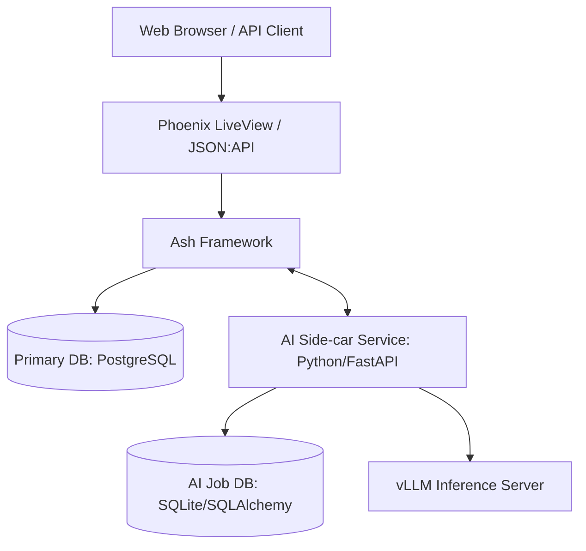

# System Architecture

This document describes the high-level architecture of the GroceryPlanner system and records key architectural decisions.

## Overview

GroceryPlanner follows a **Side-car Microservice** architecture. The system is split into a core Elixir application for business logic and UI, and a specialized Python service for AI/ML capabilities.

## Components

### 1. Core Application (Elixir/Phoenix/Ash)
*   **Role**: Handles authentication, multi-tenancy, primary data persistence, UI rendering (LiveView), and external JSON:API.
*   **Framework**: Ash Framework is used for declarative resource management and business logic.
*   **Persistence**: PostgreSQL is the "Source of Truth" for all user and domain data.

### 2. AI Side-car Service (Python/FastAPI)
*   **Role**: Provides heavy-lift computational features (OCR, SMT Solving, Zero-shot Classification).
*   **Rationale**: Access to the mature Python ML ecosystem (SQLAlchemy, Z3, Transformers, PyTorch).
*   **Persistence**: Uses an isolated database (SQLite via SQLAlchemy) for job tracking, artifact storage, and feedback.

### 3. Inference Server (vLLM)
*   **Role**: Dedicated high-performance inference for Large Language Models (LLMs) used in OCR and Chat features.
*   **Infrastructure**: Usually runs on GPU-enabled hardware, separate from the application servers.

---

## Architectural Decision Records (ADR)

### ADR 1: Decoupled Database for AI Service

**Status**: Accepted
**Date**: 2026-01-12

**Context**:
The Python AI service needs to track background jobs (OCR processing), store request/response artifacts for debugging, and capture user feedback on AI outputs.

**Decision**:
We will use an independent database (SQLAlchemy + SQLite) for the AI service instead of connecting it directly to the primary PostgreSQL database.

**Consequences**:
- **Pros**:
    - **Isolation**: Changes to the primary DB schema do not break the AI service.
    - **Simplicity**: SQLite requires no infrastructure overhead for simple job tracking.
    - **Performance**: High-volume logging and artifact storage doesn't consume connection pools or I/O on the primary domain database.
    - **Portability**: The service is database-agnostic via SQLAlchemy; it can be pointed to a dedicated Postgres instance if scale requires it.
- **Cons**:
    - **Data Duplication**: Tenant IDs and User IDs are stored in both databases (though only as foreign keys in the AI service).
    - **Management**: Two separate database backups to manage (though AI data is largely operational/transient).

### ADR 2: Communication Strategy

**Status**: Accepted
**Date**: 2026-01-12

**Context**:
Elixir needs to trigger AI tasks that can take anywhere from 100ms to 60s (OCR).

**Decision**:
- **Synchronous**: REST/JSON for low-latency tasks (Categorization, Search).
- **Asynchronous**: Job-based **Polling** pattern for high-latency tasks (Receipt OCR). The Python service manages its own internal job queue.
    - *Future Note*: Webhooks or Websockets will be considered for real-time updates as complexity grows.

### ADR 3: Data Retention & Privacy

**Status**: Accepted
**Date**: 2026-01-12

**Context**:
The AI service database is decoupled from the main user database. Deleting a user in the core app does not cascade to the AI service.

**Decision**:
- **Retention Policy**: AI artifacts and job history will be retained for **30 days**. This allows for data restoration if a user returns within that window and keeps the lightweight SQLite database from growing indefinitely.
- **Cleanup**: A scheduled task (cron) within the Python service will prune records older than 30 days.

### ADR 4: Security Model

**Status**: Accepted
**Date**: 2026-01-12

**Context**:
The AI service exposes internal API endpoints that must be protected.

**Decision**:
- **Private Network Isolation**: The AI service will have **no public ingress**. It is reachable *only* via the private internal network (Fly.io 6PN) by the Core Application.
- **Trust Boundary**: We assume the private network is a trusted environment. No application-layer shared secrets are required for this phase.
